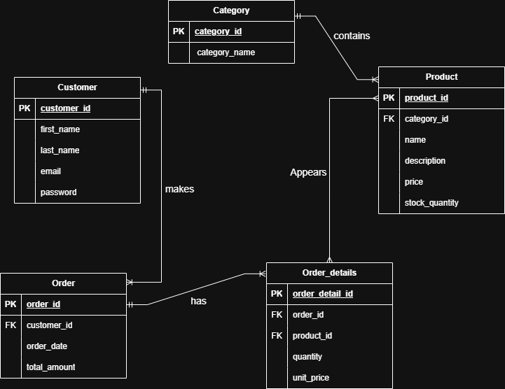

# E-commerce Database Tasks

This repository contains my work for the mentorship tasks on basic e-commerce database design.

## Files
- `ERD.png`
- `Tables.sql`
- `Data.sql`
- `Queries.sql`

## Entity Relationships
- Category to Product = One-to-Many
- Customer to Orders = One-to-Many
- Orders to Product = Many-to-Many through
- Orders to Order_details = One-to-Many
- Product to Order_details = One-to-Many

## ER Diagram


## Table Creation Script

```sql
CREATE TABLE category (
    category_id SERIAL PRIMARY KEY,
    category_name VARCHAR(100) NOT NULL
);

CREATE TABLE product (
    product_id SERIAL PRIMARY KEY,
    category_id INT NOT NULL,
    name VARCHAR(100) NOT NULL,
    description TEXT,
    price NUMERIC(10,2) NOT NULL,
    stock_quantity INT NOT NULL,
    FOREIGN KEY (category_id) REFERENCES category(category_id)
);

CREATE TABLE customer (
    customer_id SERIAL PRIMARY KEY,
    first_name VARCHAR(100) NOT NULL,
    last_name VARCHAR(100) NOT NULL,
    email VARCHAR(150) NOT NULL UNIQUE,
    password VARCHAR(255) NOT NULL
);

CREATE TABLE orders (
    order_id SERIAL PRIMARY KEY,
    customer_id INT NOT NULL,
    order_date DATE NOT NULL,
    total_amount NUMERIC(10,2) NOT NULL,
    FOREIGN KEY (customer_id) REFERENCES customer(customer_id)
);

CREATE TABLE order_details (
    order_detail_id SERIAL PRIMARY KEY,
    order_id INT NOT NULL,
    product_id INT NOT NULL,
    quantity INT NOT NULL,
    unit_price NUMERIC(10,2) NOT NULL,
    FOREIGN KEY (order_id) REFERENCES orders(order_id),
    FOREIGN KEY (product_id) REFERENCES product(product_id)
);
